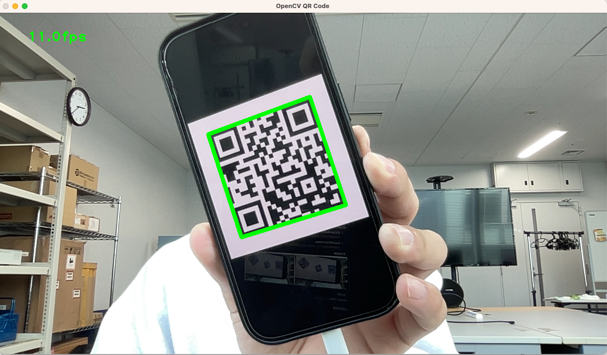
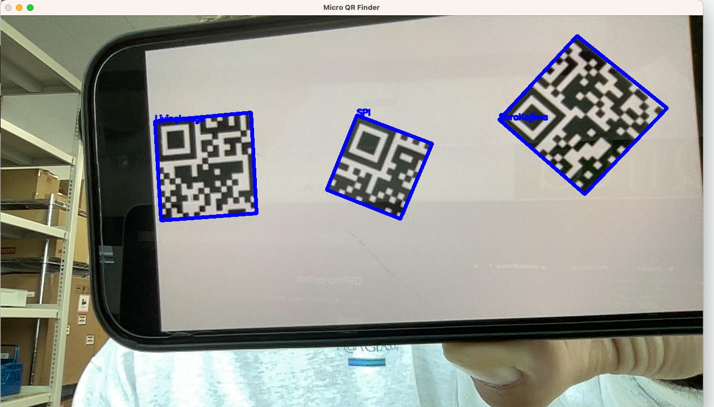

# QRFind-python
QRコードをリアルタイムで読み、格納された情報を表示するプログラム

---
## USAGE 
### - Start -
* QRCode Reader  
```user@macbook:~$ python qrFind.py ```

* microQRCode Reader  
```user@macbook:~$ python microQRFind.py``` 
### - Example -
</img>
</img>
### - Stop -
#### common: Press `Esc button`
---
## Libraries
* ### Common
  * Numpy 1.23.0
  * OpenCV-Python 3.4.18.65
* microQR reader
  * PyBoof
    *   To install pyboof with using pip, `javac` is essential.  
  Useful information is below.
	> https://github.com/lessthanoptimal/PyBoof
